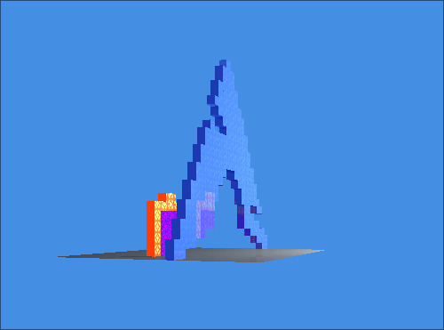
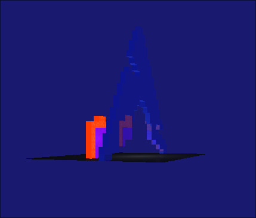
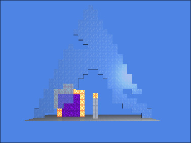
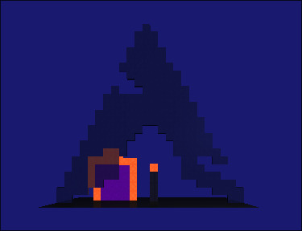
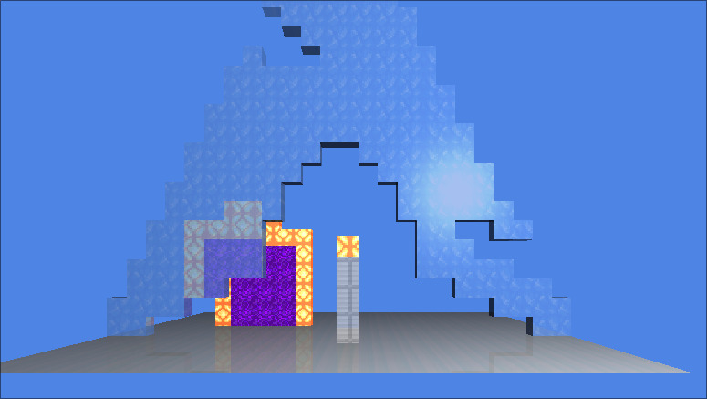
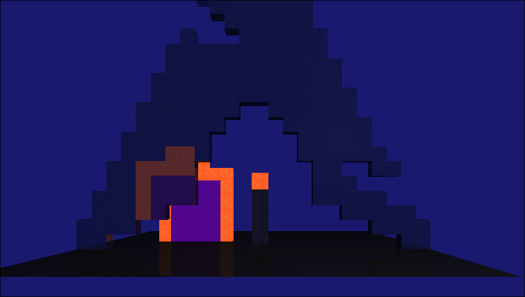

# Proyecto 2 - ArchBTWing
---
Gustavo Adolfo Cruz Bardales
#22779
## Fotos del proyecto
---







---
## Dependencias
- Cargo
---
## ¿Cómo ejecutar el proyecto?
```sh
cargo build --release
./target/release/GC-PROY2_RT
```
---
